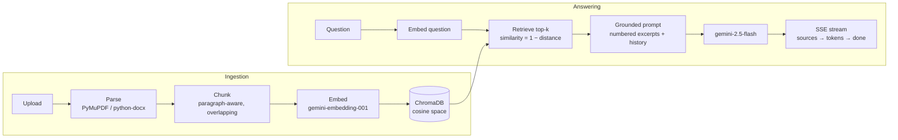

# DocuMind

**Upload your documents, ask questions in plain language, get answers with page-level citations — powered by a transparent, inspectable RAG pipeline.**

[](https://github.com/YOUR-USERNAME/docmind/actions/workflows/ci.yml)


DocuMind is a full-stack Retrieval-Augmented Generation (RAG) app: drop in PDFs, DOCX, TXT or Markdown files and chat with them. Every answer is grounded **strictly** in your uploads and carries inline citations like `[1]` that expand to the exact source snippet, filename, and page number. If the answer isn't in your documents, DocuMind says so instead of making something up.

## Demo

> 🎬 Record a short GIF — upload a PDF, ask a question, watch the streamed answer with citation chips — save it as `docs/demo.gif`, then uncomment the image below. (ScreenToGif on Windows, Kap on macOS.)

<!--  -->

## Features

- **Grounded answers with citations** — every factual claim cites `[n] filename · p.X`; chips expand to the source snippet and similarity score
- **Multi-format ingestion** — PDF (real page numbers via PyMuPDF), DOCX, TXT, Markdown; extension and size validation (20 MB default)
- **Token-by-token streaming** — Server-Sent Events over `fetch` + `ReadableStream`, with live sources before the first token
- **Provider-agnostic core** — RAG code depends on `LLMProvider` / `EmbeddingProvider` protocols, not on Gemini; swapping in another vendor is one class
- **Runs anywhere** — local ChromaDB + SQLite, no external services; one Docker image serves API and UI
- **Honest engineering** — typed code end to end, deterministic offline tests, consistent error shapes, no secrets in the repo

**Not in v1 (by design):** authentication, multi-user tenancy, OCR for scanned PDFs, cloud deploy automation. See the [roadmap](#roadmap).

## How it works



On upload, files are parsed into pages, split into ~1,200-character chunks (paragraph boundaries preferred, sentences next, hard cut last, with 200 characters of overlap so meaning never dies at a boundary), embedded in batches, and indexed in a persistent local ChromaDB collection alongside their metadata. At question time the query is embedded, the top-k chunks are retrieved by cosine similarity, and a strict grounding prompt — *use only the numbered excerpts, cite every claim, answer in the user's language* — is streamed through Gemini. The UI receives the sources first, then tokens, so citations are clickable the moment the answer starts appearing. If nothing is uploaded yet, the backend short-circuits with a friendly message and never calls the LLM.

## Quickstart

**Prerequisites:** a free Gemini API key from [Google AI Studio](https://aistudio.google.com/apikey) — plus either Docker, or Python 3.11+ and Node 20+.

```bash
git clone https://github.com/YOUR-USERNAME/docmind.git
cd docmind
cp .env.example .env
# open .env and paste your GEMINI_API_KEY
```

### Path A — Docker (recommended)

```bash
mkdir -p data   # on Linux: pre-create so the non-root container user can write to it
docker compose up --build
```

Open http://localhost:8000 — API and UI are served from the same container. Uploaded data persists in `./data`.

### Path B — manual (two dev servers)

```bash
# Terminal 1 — backend on :8000
cd backend
python -m venv .venv && source .venv/bin/activate   # Windows: .venv\Scripts\activate
pip install -e ".[dev]"
uvicorn app.main:create_app --factory --reload

# Terminal 2 — frontend on :5173 (proxies /api to :8000)
cd frontend
npm install
npm run dev
```

Open http://localhost:5173. Interactive API docs live at http://localhost:8000/docs.

## Configuration

All configuration is environment-driven (see `.env.example`):

| Variable | Default | Meaning |
|---|---|---|
| `GEMINI_API_KEY` | — (required) | Your Gemini API key; the app refuses to start without it |
| `GEMINI_CHAT_MODEL` | `gemini-2.5-flash` | Chat/completion model |
| `GEMINI_EMBEDDING_MODEL` | `gemini-embedding-001` | Embedding model |
| `CHUNK_SIZE` | `1200` | Target chunk size in characters |
| `CHUNK_OVERLAP` | `200` | Characters of context shared between neighboring chunks |
| `TOP_K` | `5` | Number of chunks retrieved per question |
| `MIN_SIMILARITY` | `0.25` | Best matches below this score are logged as low-confidence retrievals; the grounding prompt still enforces an honest "not found" |
| `MAX_FILE_MB` | `20` | Upload size limit |
| `DATA_DIR` | `./data` | Home of uploads, ChromaDB, and the SQLite registry |
| `ALLOWED_ORIGINS` | `http://localhost:5173` | CORS allowlist (comma-separated) |

## API reference

| Method & path | Request | Response |
|---|---|---|
| `GET /api/health` | — | `{"status":"ok"}` |
| `POST /api/documents` | multipart `file` | `201` → `{id, filename, pages, chunks, size_bytes, status, created_at}` |
| `GET /api/documents` | — | `200` → array of document records |
| `DELETE /api/documents/{id}` | — | `204` (removes vectors, raw file, and registry row) |
| `POST /api/chat` | `{"question": str, "history": [{role, content}]}` | SSE stream: `sources` → `token`* → `done` \| `error` |

Errors use a consistent `{"detail": "human-readable message"}` shape: `400` invalid file, `413` too large, `404` unknown document, `422` invalid request body, `502` upstream LLM failure.

## Project structure

```
docmind/
├─ backend/
│  ├─ app/
│  │  ├─ main.py            # app factory: wiring, CORS, static mount
│  │  ├─ config.py          # typed env settings (pydantic-settings)
│  │  ├─ api/               # documents + SSE chat endpoints
│  │  ├─ core/              # parsing, chunking, ingestion, retrieval, rag
│  │  ├─ providers/         # LLM/embedding protocols + Gemini impl
│  │  └─ db/                # SQLite registry + ChromaDB wrapper
│  └─ tests/                # offline tests with fake providers
├─ frontend/                # React 18 + TypeScript strict + Tailwind
│  └─ src/
│     ├─ lib/api.ts         # typed client + SSE parser
│     └─ components/        # Sidebar, Chat, MessageBubble, SourceChips, Toast
├─ Dockerfile               # multi-stage: build UI → slim Python runtime
└─ .github/workflows/ci.yml # ruff + pytest + tsc/vite build
```

## Testing

```bash
cd backend
pytest
```

Tests are deterministic and never touch the network: a fake embedding provider produces stable bag-of-words vectors (so retrieval ranking is genuinely testable) and a fake LLM yields a fixed token stream. Coverage focuses on the chunker (boundaries, overlap, Unicode), the ingestion pipeline, retrieval ranking, and the full API contract including SSE event order.

## Roadmap

- Hybrid retrieval (BM25 + vectors with reciprocal rank fusion) and LLM reranking
- OCR for scanned PDFs
- More providers (OpenAI, Anthropic, local models) via the existing protocols
- Background ingestion with progress events
- Authentication and multi-user workspaces
- Chat export to Markdown

## License

[MIT](LICENSE) — replace `[YOUR NAME]` in the LICENSE file with your own name.
